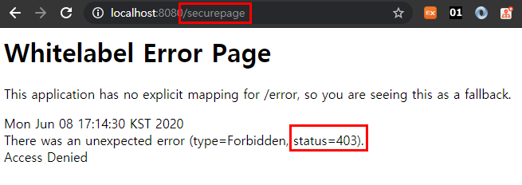

## SpringSecurity 설정하기
스프링 시큐리티를 이용해 로그인/로그아웃, 회원가입 등을 개발하기 위한 프로젝트를 생성해보고 기본적인 설정을 해보도록 하겠습니다.

### 1. 프로젝트 생성
Gradle을 이용해 스프링부트 프로젝트를 생성해 보겠습니다.

gradle 설정
```groovy
plugins {
    id 'org.springframework.boot' version '2.3.0.RELEASE'
    id 'io.spring.dependency-management' version '1.0.9.RELEASE'
    id 'java'
}

group = 'me.weekbelt'
version = '0.0.1-SNAPSHOT'
sourceCompatibility = '11'

configurations {
    compileOnly {
        extendsFrom annotationProcessor
    }
}

repositories {
    mavenCentral()
}

dependencies {
    implementation 'org.springframework.boot:spring-boot-starter-data-jpa'
    implementation 'org.springframework.boot:spring-boot-starter-security'
    implementation 'org.springframework.boot:spring-boot-starter-web'
    compile group: 'org.springframework.boot', name: 'spring-boot-starter-thymeleaf', version: '2.3.0.RELEASE'

    compileOnly 'org.projectlombok:lombok'
    developmentOnly 'org.springframework.boot:spring-boot-devtools'
    runtimeOnly 'com.h2database:h2'
    annotationProcessor 'org.projectlombok:lombok'
    testImplementation('org.springframework.boot:spring-boot-starter-test') {
        exclude group: 'org.junit.vintage', module: 'junit-vintage-engine'
    }
    testImplementation 'org.springframework.security:spring-security-test'
}

test {
    useJUnitPlatform()
}

```
위 처럼 의존성 설정을 한 후에 프로젝트를 실행 시켜 봅니다.


단순히 SpringSecurity의존성만 설정해주었는데 어떤요청에도 로그인화면이 띄워집니다. 그 이유는 스프링 시큐리티가 자동으로 모든요청에대해 로그인인증을 하도록 설정이 되어있기 때문입니다. 그래서 우리는 따로 SpringSecurity관련 설정 클래스를 만들어 설정을 바꿔줘야 합니다.

<hr>

## 2. 스프링 시큐리티 설정
해당 패키지아래에 SecurityConfig를 생성합니다.

```java
package me.weekbelt.security.configure;

import org.springframework.boot.autoconfigure.security.servlet.PathRequest;
import org.springframework.context.annotation.Configuration;
import org.springframework.security.config.annotation.web.builders.HttpSecurity;
import org.springframework.security.config.annotation.web.builders.WebSecurity;
import org.springframework.security.config.annotation.web.configuration.EnableWebSecurity;
import org.springframework.security.config.annotation.web.configuration.WebSecurityConfigurerAdapter;

@Configuration
@EnableWebSecurity
public class SecurityConfig extends WebSecurityConfigurerAdapter {

    @Override
    protected void configure(HttpSecurity http) throws Exception {
        http
                .csrf().disable()                       
                .authorizeRequests()                    
                .antMatchers("/", "/main").permitAll()  
                .anyRequest().authenticated();          
    }

    @Override
    public void configure(WebSecurity web) throws Exception {
        web.ignoring().requestMatchers(PathRequest.toStaticResources().atCommonLocations()); // 5번
    }
}

```
protected void configure(HttpSecurity http) 메소드를 오버라이딩 한다는 것은 인증/인가에 대한 설정을 한다는 의미입니다. 가장 중요한 메소드라고 말할 수 있습니다.<br><br>
http.csrf().disable()는 csrf()라는 기능을 끄라는 설정입니다. csrf는 보안 설정 중 post방식으로 값을 전송할 때 token을 사용해야하는 보안 설정입니다. csrf은 기본으로 설정되어 있는데요. csrf를 사용하게 되면 보안성은 높아지지만 개발초기에는 불편함이 있다는 단점이 있습니다. 그래서 csrf 기능을 끄도록 한 것입니다. disable()메소드는 http(여기에선 HttpSecurity)를 리턴합니다.<br><Br>

```java
http                    
        .authorizeRequests()                    
        .antMatchers("/", "/main").permitAll()  
        .anyRequest().authenticated();    
```
위의 설정은 "/"와 "/main" 경로는 누구나 접근(permitAll)할 수 있도록 한 것이며
그외의 경로는 인증을 한 후에만 접근할 수 있다는 것을 의미합니다.

```java
@Override
public void configure(WebSecurity web) throws Exception {
    web.ignoring().requestMatchers(PathRequest.toStaticResources().atCommonLocatons());
}
```
위의 설정은 html,css,js와 같은 정적 리소스들은 SpringSecurity의 설정을 무시하도록 하기 위한 설정입니다.

<hr>

## 3. 보안 설정 테스트를 위한 컨트롤러 클래스 작성하기
기본적인 보안 설정을 했다면, 실제로 잘 동작하는지 테스트하기 위한 컨트롤러를 작성해 보도록 하겠습니다. 아래의 MainController는 2개의 path를 처리하고 있습니다. 참고로 @ResponseBody 어노테이션이 붙어있을 경우엔 리턴하는 문자열을 화면에 직접 출력하게 됩니다.
@ResponseBody 어노테이션이 없을 때는 뷰(View)이름을 리턴했고, 템플릿엔진은 Thymeleaf를 사용했습니다.

2개의 path는 각각 "/main"과 "/securepage"입니다. 앞에서 "/main"은 누구나 접근할 수 있다고 했었습니다. "/"과 "/main"을 제외하면 모두 인증 후에 사용한다고 설정되어 있었습니다.

```java
package me.weekbelt.security.controller;

import org.springframework.stereotype.Controller;
import org.springframework.web.bind.annotation.RequestMapping;
import org.springframework.web.bind.annotation.ResponseBody;

@Controller
public class MainController {

    @RequestMapping("/main")
    @ResponseBody
    public String main() {
        return "main page";
    }

    @RequestMapping("/securepage")
    @ResponseBody
    public String securitypage() {
        return "secure page";
    }
}

```

컨텍스트 루트(Context root)는 "/securityexam"으로 설정하여 웹 어플리케이션을 실행합니다.

앞에서 작성한 컨트롤러 메소드가 호출되도록 브라우저를 열고 URL을 입력합니다.

http://localhost:8080/main 을 실행하면 아래의 그림과 같이 잘 표시되는 것을 알 수 있습니다.


http://localhost:8080/securepage 를 요청해보도록 하겠습니다.
응답 상태 코드가 403이 온 것을 알 수 있습니다. 응답 상태 코드가 403이 왔다는 것은 해당 경로는 인증을 거친 후에만 접근을 해야 한다는 것을 의미합니다.




<br><br>
참고 자료: [부스트코스 - 웹 백엔드](https://www.edwith.org/boostcourse-web-be/lecture/58998/)